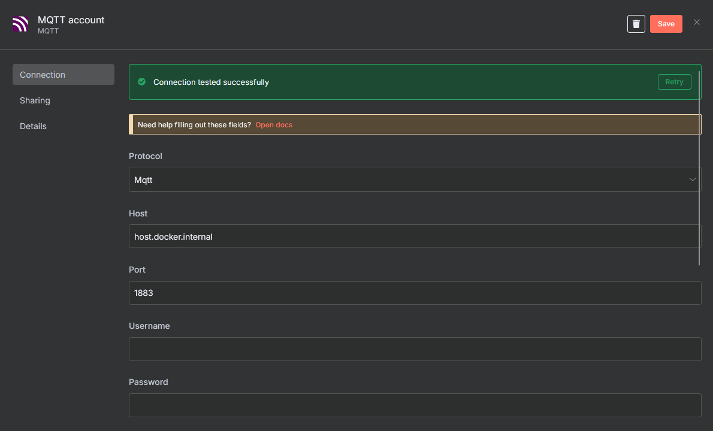

# N8N Configuration

This folder contains the documentation and resources for configuring N8N in the Robot project.

## MQTT Credentials Configuration

The file `MQTT_Credentials_Settings.png` shows the steps to configure MQTT credentials in N8N:

This screenshot illustrates how to set up the authentication parameters for the MQTT connection in N8N, which is required to interact with the project's MQTT bro
